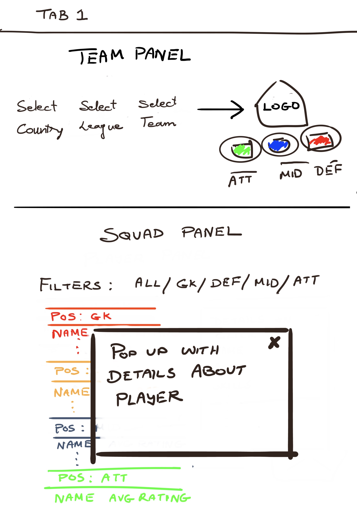
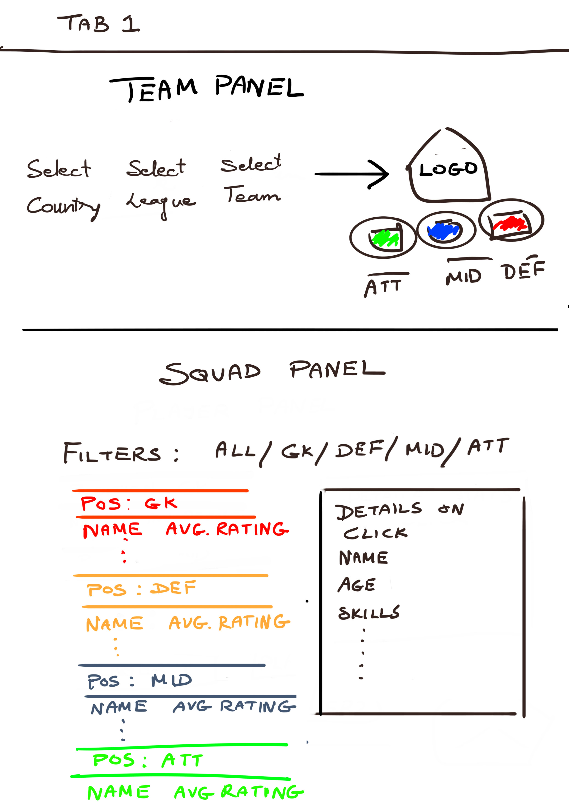
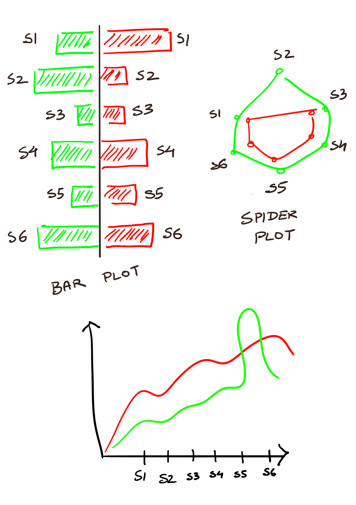
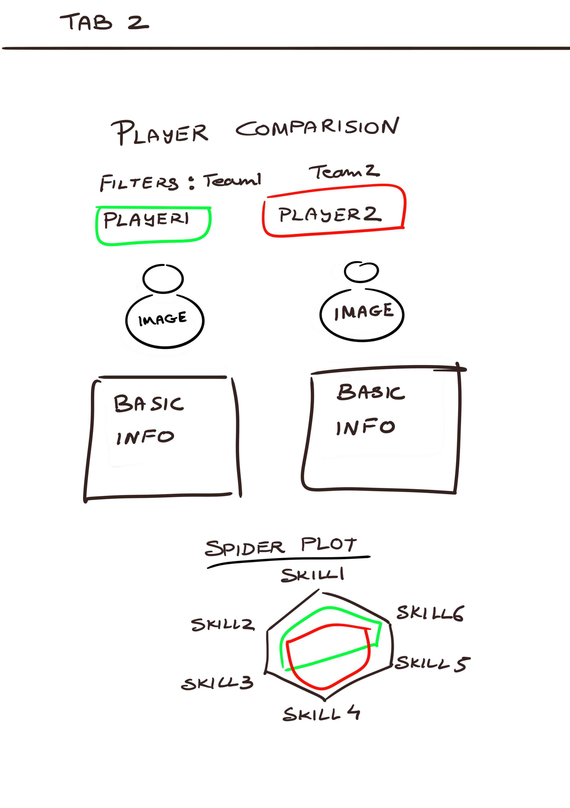
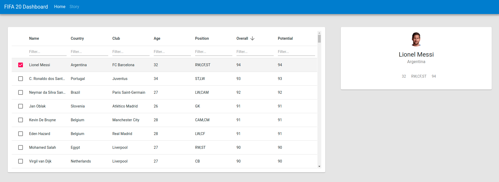

# Process Book - FIFA20 Dashboard

## Overview and Motivation
While searching for data on sports, we came across Soccer player ratings (FIFA20)
on Kaggle. Though FIFA 20 is a soccer simulation video game developed by EA,
ratings within the game are considered as the best, even among professional
soccer players. These ratings showcase the players in the game based on their
performances from the past year of world soccer. Since we all are passionate
soccer fans, we immediately decided to work with this data.

With this data, we would like to visualize player information from different
perspectives.
1. Player Rooster
   This would give the list of all players playing for a given club, as well as
   their individual ratings.
2. Player Comparison
   This would let us compare the ratings of any two chosen players.
3. Interactive Chart depicting Age, Salary and Rating

Each of these perspectives require different visualizations as to effectively
convey the information. The objective is to identify the most effective
visualization for each of these perspectives.

## Sources Code
All the code for this project can be found on [GitHub][src-code].

## Team
* Lakshmi Narayanan Ramasamy<br>
  UID: u1201500<br>
  Email: [lakshminarayanan.ramasamy@utah.edu](mailto:lakshminarayanan.ramasamy@utah.edu)
* Rohit Singh<br>
  UID: u1210167<br>
  Email: [singh.rohit@utah.edu](mailto:singh.rohit@utah.edu)
* Sachin Boban<br>
  UID: u1210407<br>
  Email: [sachin.boban@utah.edu](mailto:sachin.boban@utah.edu)

## Development Build
Inoder generate a development build we make use of `Node.js NPM`. NPM is a
packet manager for `Node.js` packages or modules.
[www.npmjs.com](www.npmjs.com) hosts thousands of free packages to download and
use.

### Installation
Clone the [repo][src-code] and install dependencies using the following
commands:
```sh
$ cd datavis-fifa20-dashboard/
$ npm install
```

### Usage
1. Start the node server using the following command:
   ```sh
   $ npm start
   ```
2. Navigate to [localhost:3000/](http://localhost:3000/) on your browser to view
   the app.

## Data
All the player ratings as well as league information are stored as `csv` files
in Github (`src/data/`).
### Player Ratings
FIFA 20 Player Ratings data was obtained from [Kaggle][data-src]. This data
contains ratings for around 18K professional soccer players. Each player has
around 70 attributes. This data would require some cleanup as we will not be
needing all the attributes. Missing values in the dataset need to be marked with
some flags (e.g. NA/UNK).

### League Information
In order to provide league-wise visualization of the data, we need a mapping
between club name and the league which it is a part of. However, only club names
are available in Kaggle dataset. Further details about the club like ratings and
league information was obtained by scraping [FIFA Index website][fifa-idx].

This scraping was done using python script. The script can be found
[here][scrape-script].

## Visualization Design
The FIFA player dataset contains 18K players. Visualizing the whole set of
players needs a good visualization design so that the information is conveyed
correctly and concisely. User experience is an important factor that drives the
following designs:

### Player Rooster & Comparisions
Player Rooster will let the user to the list of players belonging to a given
club. Inorder to depict the player ratings, the naive approach would be to list
players and their ratings in a table. As the name suggests, it is naive.
Instead, we decided to depict grouped list of players, based on their position
in the team. Such a grouping would make it easier to find a particular player.
Upon clicking a player, we can show the corresponding ratings.

We thought of showing the ratings in a pop-up. However, to see rating of another
player, the user would need to close the pop-up and then click on the next
player. Moreover, such a design would leave a lot of unused space on the screen.
Instead of popup, we could depict the ratings on the right side upon clicking a
player. This would use screen space more effectively. Also, the user will be
making lesser clicks than the pop-up design.


Player comparison is very important is Soccer, especially when substituting a
player during a game or while searching to replace a player in a squad. For
comparisons, we came up with the following ideas:

One major use of such player comparisons in Soccer to find a substitute during a
game or to replace a player during the transfer window. For such a use-case, the
spider plot seems to be the best visualization. Players fit to play in similar
positions will have similar skills, which is much easier to read from the spider
plot.


### Combining Rating and Comparisions
Since Player ratings and comparisions are very related to each other, it made
more sense to combine the above two entities into a single page. If the user
selects a single player, we shall display the ratings of the selected player.
Upon selecting another player, the visualization transitions to depict
the comparision between the selected two players.

Instead of asking the user to select a team/league in the default view, the
entire player list is displayed. This ensures that when the default view is
rendered, the page would not be entered. The list shall depict the following:
* Name
* Country
* Club
* Age
* Position
* Overall
* Potential

**Searching through the list**
The user also has the option to search or apply filter to each of these
attributes seperately. Having individual search option (for each attribute)
makes searching easier, as it narrows down the search domain.

**Sorting the list**
In addition, the use can also sort the list based on any of the attributes,
by clicking on the table header. This way user easily see the player with the
highest rating/attribute.

**Selecting Comparision Attributes**
Player comparision begins with a default set of attributes. User can change
any of the selected attributes as to compare skills that interests him/her.

A screenshot of the current prototype can be seen below:


### Wage-Age-Rating Distribution


## Must-Have Features
* Having the correct player list for a club is crucial. An incorrect list would
  make it impossible for the user to find the player he/she is looking for.
* The club-league mapping must be done correctly for the same reason stated
  above.
* User should be able to select any Club/League to see player ratings
* While comparing any two players, the points of comparisons have to be
  determined based on the position of the first player. Comparing any two
  players with pre-determined attributes does not make any sense. For e.g., the
  important attributes of a goalkeeper is completely different from that of a
  striker. Once displayed, user should be able to modify any of the selected
  default attributes.
* Wage distribution is an important factor when it comes to Soccer. It is a must
  to depict the distribution of wages based on factors like age, ratings, etc.

## Optional Features
* Relative positioning (percentile) of a player’s rating with respect to all
  other players in the dataset.

## Project Schedule
* **Week 1** (Oct 26 - Nov 1): Data cleanup, scraping club, and league information.
* **Week 2** (Nov 2 - Nov 8):
  + Setup the website skeleton for a prototype with 3 tabs and placeholders for
    views.
  + Decide on specific data points.
* **Week 3** (Nov 9 - Nov 15):Implementing must-have functionality for all 3 tabs
  (1 tab per team member)
* **Week 4** (Nov 15 - Nov 22):
  + Improvising on the basic implementation by adding more interactivity and
    features like storytelling, tool-tips.
  + Unit and functional testing of the modules.
* **Week 5** (Nov 22 - Nov 27):
  + Integration of modules.
  + Final polishing
  + Documentation
* Submission!

[src-code]: https://github.com/sachinboban/datavis-fifa20-dashboard
[data-src]: https://www.kaggle.com/sagunsh/fifa-20-complete-player-dataset
[fifa-idx]: https://www.fifaindex.com/teams/?league=53&order=desc
[scrape-script]: https://github.com/sachinboban/datavis-fifa20-dashboard/blob/master/scripts/scrape-web.py
